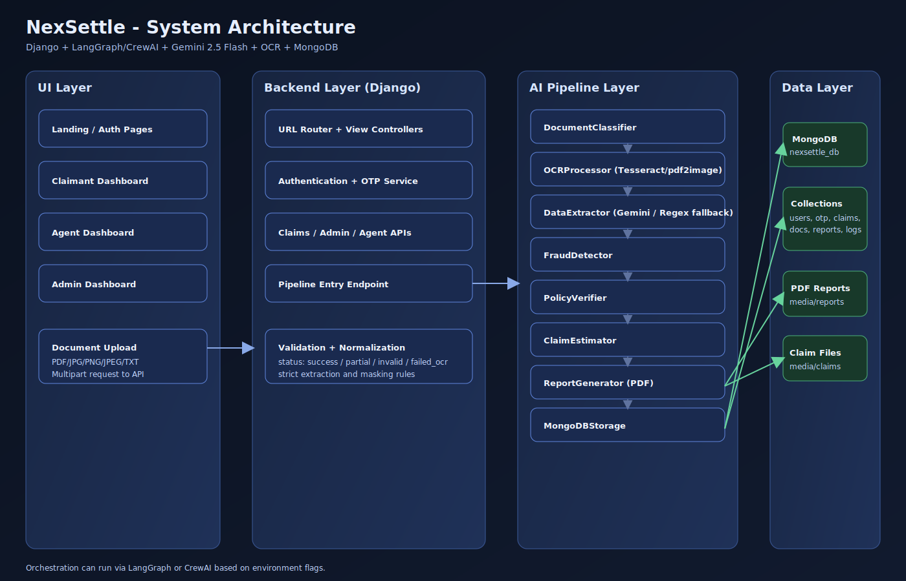
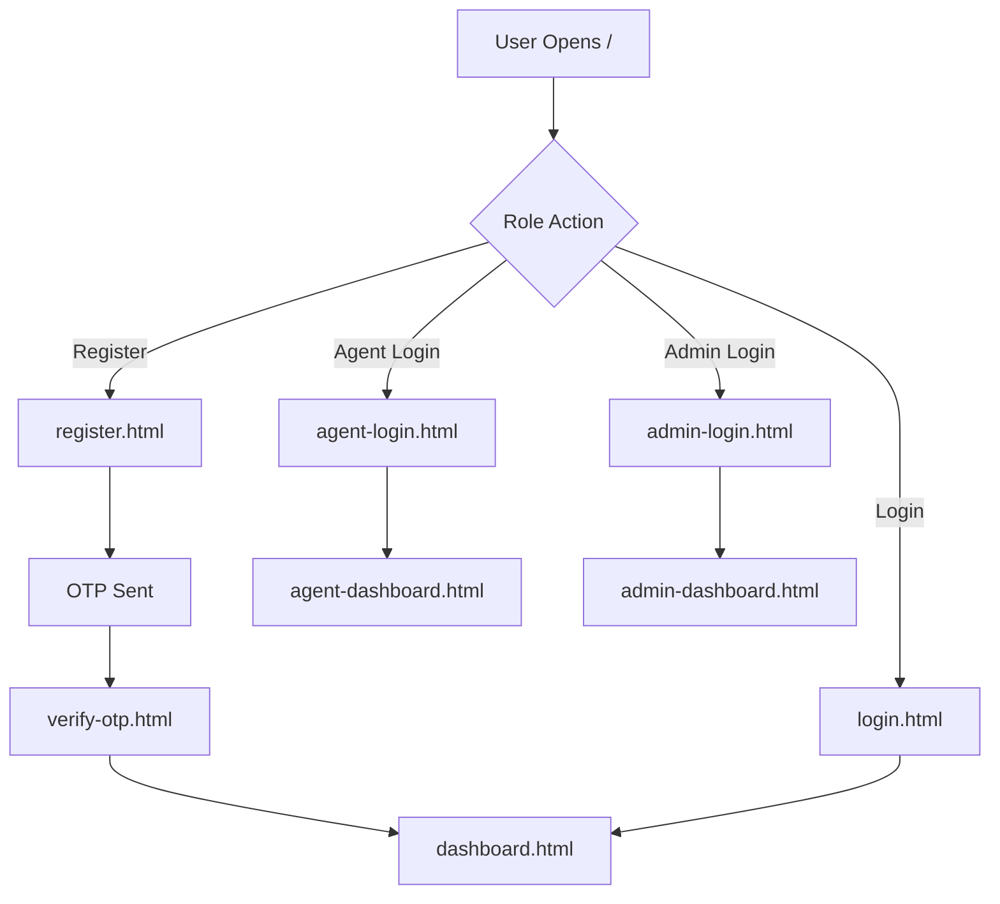
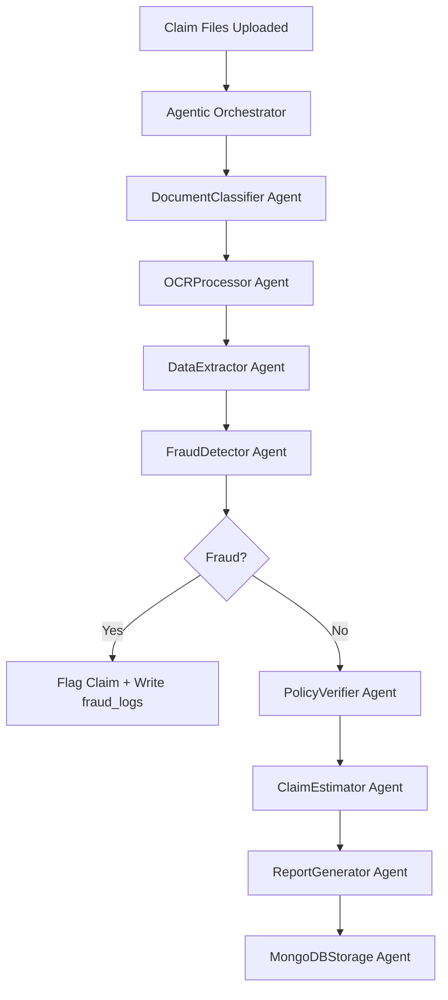
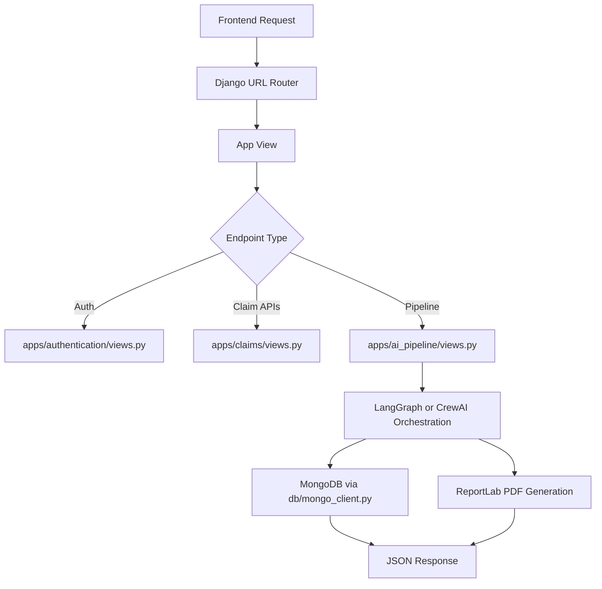
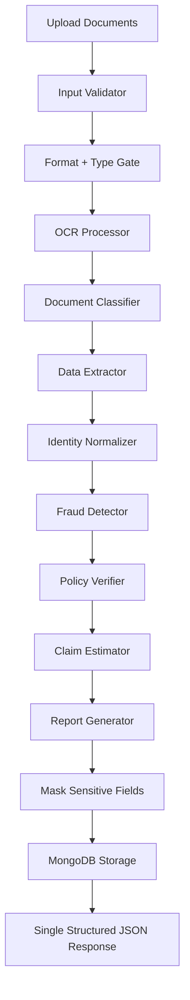

# NexSettle - AI-Powered Insurance Claims Automation Platform

> **Tech Stack:** Django · LangGraph · CrewAI · Gemini 2.5 Flash · Tesseract OCR · MongoDB · Vanilla HTML/CSS/JS


---

## Table of Contents

1. [Project Overview](#project-overview)
2. [Architecture](#architecture)
3. [Project Structure](#project-structure)
4. [Prerequisites](#prerequisites)
5. [Environment Variables](#environment-variables)
6. [Quick Start (Windows)](#quick-start-windows)
7. [Manual Setup](#manual-setup)
8. [Docker Setup](#docker-setup)
9. [One-command Bootstrap](#one-command-bootstrap)
10. [API Reference](#api-reference)
11. [Frontend Pages](#frontend-pages)
12. [MongoDB Collections](#mongodb-collections)
13. [AI Pipeline](#ai-pipeline)
14. [Credentials (Default)](#credentials-default)
15. [Development Notes](#development-notes)
16. [CI/CD (GitHub Actions)](#cicd-github-actions)
17. [Render Deployment](#render-deployment)
18. [License](#license)

---

## Project Overview

NexSettle automates the entire insurance claim lifecycle:

| Step | Technology | Description |
|------|-----------|-------------|
| Document Upload | Django REST | PDF/PNG/JPG/JPEG multipart upload |
| OCR | Tesseract OCR + pdf2image | Text extraction from scanned docs |
| Classification | Keyword Detection | Identifies 7+ document types |
| Data Extraction | Gemini 2.5 Flash | Structured JSON from document text |
| Fraud Detection | Rule-based + AI | Cross-doc validation, format checks |
| Policy Verification | MongoDB lookup | Aadhaar/PAN cross-check |
| Claim Estimation | Business rules | Natural/Accidental death payout |
| PDF Report | ReportLab | Auto-generated settlement report |
| Storage | MongoDB | All data in `nexsettle_db` |

---

## Architecture

Architecture diagram file:
[View SVG](docs/architecture.svg)



### UI Flow



### Agent Flow



### Backend Flow



### Full Project Flow

```mermaid
flowchart LR
    A[User Uploads Claim Documents] --> B[Frontend HTML/CSS/JS]
    B --> C[Django REST API]
    C --> D[Document Intake + Validation]
    D --> E[OCR Engine: Tesseract/pdf2image]
    E --> F[Classification + Extraction]
    F --> G[Gemini 2.5 Flash]
    G --> H[Fraud + Policy Verification]
    H --> I[Claim Estimation]
    I --> J[PDF Report Generation]
    J --> K[MongoDB: nexsettle_db]
    K --> L[Agent/Admin Review]
    L --> M[Settlement Decision]
```



---

## Project Structure

```
NexSettle_Project/
|-- .github/
|   |-- workflows/
|   |   |-- ci.yml                          # GitHub Actions CI (install, check, smoke tests)
|   |   `-- deploy-render.yml               # GitHub Actions deploy trigger for Render
|-- docs/
|   `-- architecture.svg                    # High-level architecture diagram (linked above)
|-- backend/
|   |-- apps/                               # Django app modules (API domains)
|   |   |-- admins/
|   |   |   |-- apps.py                     # Django app config for admin module
|   |   |   |-- urls.py                     # Admin API routes
|   |   |   `-- views.py                    # Admin auth/dashboard/approval handlers
|   |   |-- agents/
|   |   |   |-- apps.py                     # Django app config for agent module
|   |   |   |-- urls.py                     # Agent API routes
|   |   |   `-- views.py                    # Agent login/review handlers
|   |   |-- ai_pipeline/
|   |   |   |-- apps.py                     # Django app config for AI pipeline
|   |   |   |-- claim_estimator.py          # Claim amount estimation logic
|   |   |   |-- crew_pipeline.py            # CrewAI orchestration flow
|   |   |   |-- data_extractor.py           # Structured field extraction logic
|   |   |   |-- document_classifier.py      # Document type classifier
|   |   |   |-- fraud_detector.py           # Fraud signal checks
|   |   |   |-- pipeline.py                 # LangGraph/LangChain orchestration flow
|   |   |   |-- policy_verifier.py          # MongoDB policy cross-verification
|   |   |   |-- urls.py                     # Pipeline API routes
|   |   |   `-- views.py                    # Upload/process endpoints
|   |   |-- authentication/
|   |   |   |-- apps.py                     # Django app config for auth module
|   |   |   |-- urls.py                     # Register/login/OTP API routes
|   |   |   `-- views.py                    # Auth and OTP handlers
|   |   |-- claims/
|   |   |   |-- apps.py                     # Django app config for claims module
|   |   |   |-- urls.py                     # Claim listing/detail/status routes
|   |   |   `-- views.py                    # Claim API logic
|   |   |-- documents/
|   |   |   |-- apps.py                     # Django app config for documents module
|   |   |   |-- urls.py                     # Document endpoints
|   |   |   `-- views.py                    # Document upload/access handlers
|   |   |-- fraud_detection/
|   |   |   |-- apps.py                     # Django app config for fraud module
|   |   |   |-- urls.py                     # Fraud log/check routes
|   |   |   `-- views.py                    # Fraud API handlers
|   |   `-- reports/
|   |       |-- apps.py                     # Django app config for reports module
|   |       |-- report_generator.py         # ReportLab PDF generation logic
|   |       |-- urls.py                     # Report API routes
|   |       `-- views.py                    # Report download/generate handlers
|   |-- db/
|   |   |-- mongo_client.py                 # Central MongoDB client + DB getter
|   |   `-- __init__.py                     # DB package marker
|   |-- management/
|   |   `-- management/
|   |       `-- commands/                   # Custom Django management commands
|   |           |-- backfill_user_ids.py    # Backfills missing user_id values
|   |           |-- bootstrap_project.py    # One-command setup/bootstrap
|   |           |-- seed_admin.py           # Seeds default admin user
|   |           |-- seed_policy_holders.py  # Seeds policy holder sample data
|   |           |-- setup_mongodb.py        # Creates DB collections + indexes
|   |           `-- smoke_test_flow.py      # End-to-end flow validation command
|   |-- media/
|   |   |-- claims/                         # Uploaded claim files (runtime generated)
|   |   `-- reports/                        # Generated PDF reports
|   |-- nexsettle/
|   |   |-- frontend_views.py               # Serves frontend files via Django
|   |   |-- settings.py                     # Django settings + env configuration
|   |   |-- urls.py                         # Root URL router
|   |   |-- wsgi.py                         # WSGI entrypoint
|   |   `-- __init__.py                     # Project package marker
|   |-- scripts/
|   |   `-- seed_admin.py                   # Script-level admin seeding utility
|   |-- utils/
|   |   |-- id_generators.py                # Claim/user ID generation helpers
|   |   |-- jwt_utils.py                    # JWT create/verify helpers
|   |   |-- masking.py                      # Aadhaar/PAN/account masking utilities
|   |   |-- ocr.py                          # OCR helper wrappers (Tesseract/PDF)
|   |   |-- validators.py                   # Validation helpers/regex checks
|   |   `-- __init__.py                     # Utils package marker
|   |-- .env                                # Local environment values (never commit real secrets)
|   |-- .env.example                        # Environment template for setup/deploy
|   |-- Dockerfile                          # Backend image build instructions
|   |-- manage.py                           # Django management entrypoint
|   |-- Procfile                            # Render process command definition
|   |-- requirements.txt                    # Core Python dependencies
|   |-- requirements-crewai-tools.txt       # Optional CrewAI tools dependency set
|   |-- runtime.txt                         # Render Python runtime version
|   `-- start_render.sh                     # Render startup script (collect/check/run)
|-- frontend/
|   |-- index.html                          # Landing page
|   |-- css/
|   |   `-- main.css                        # Global frontend styling
|   |-- js/
|   |   |-- api.js                          # API client functions (fetch wrappers)
|   |   `-- ui.js                           # Frontend UI behaviors and interactions
|   |-- pages/
|   |   |-- admin-dashboard.html            # Admin dashboard UI
|   |   |-- admin-login.html                # Admin login page
|   |   |-- agent-dashboard.html            # Agent dashboard UI
|   |   |-- agent-login.html                # Agent login page
|   |   |-- dashboard.html                  # Claimant dashboard page
|   |   |-- login.html                      # Claimant login page
|   |   |-- register.html                   # Claimant registration page
|   |   `-- verify-otp.html                 # OTP verification page
|   `-- assets/                             # Static assets (images/icons, optional)
|-- .gitignore                              # Git ignore rules
|-- docker-compose.yml                      # Local Docker services (backend + MongoDB)
|-- README.md                               # Project documentation
|-- render.yaml                             # Render Blueprint configuration
|-- render_readme.md                        # Detailed Render deployment guide
|-- run.bat                                 # Windows quick-start runner
|-- seed_admin.bat                          # Windows helper to seed admin
`-- structure.txt                           # Generated tree reference file
```

---

## Prerequisites

| Requirement | Version | Download |
|------------|---------|----------|
| Python | 3.12+ | https://python.org |
| MongoDB | 7.0+ | https://mongodb.com/try/download/community |
| Tesseract OCR | 5.x | https://github.com/UB-Mannheim/tesseract/wiki *(Windows)* |
| Poppler | latest | https://github.com/oschwartz10612/poppler-windows *(Windows)* |
| Git | any | https://git-scm.com |

> **Windows Tesseract:** After installing, Tesseract is typically at:
> `C:\Program Files\Tesseract-OCR\tesseract.exe`
> This path is already pre-configured in `backend\.env`.

> **Windows Poppler:** After downloading, add the `bin/` folder to your system PATH so `pdf2image` can find `pdftoppm`.

---

## Environment Variables

| Variable | Default | Description |
|----------|---------|-------------|
| `SECRET_KEY` | (dev key) | Django secret key |
| `DEBUG` | `True` | Django debug mode |
| `MONGO_URI` | `mongodb://localhost:27017/` | MongoDB connection string |
| `MONGO_DB_NAME` | `nexsettle_db` | Database name |
| `JWT_SECRET` | (dev key) | JWT signing secret |
| `GEMINI_API_KEY` | `""` | Google Gemini API key *(required for AI extraction)* |
| `EMAIL_HOST` | `smtp.gmail.com` | SMTP server |
| `EMAIL_HOST_USER` | `""` | Gmail address for OTP emails |
| `EMAIL_HOST_PASSWORD` | `""` | Gmail App Password |
| `TESSERACT_CMD` | `C:\Program Files\Tesseract-OCR\tesseract.exe` | Tesseract path (Windows) |

> Get a Gemini API key at: https://aistudio.google.com/app/apikey

---

## Quick Start (Windows)

```batch
# 1. Clone the repo
git clone https://github.com/SANJAI-s0/NexSettle.git
cd NexSettle_Project

# 2. Start MongoDB (if not running as a service)
mongod --dbpath C:\data\db

# 3. Run the backend (auto-creates venv + installs deps)
run.bat

# 4. In a new terminal, seed the default admin account
seed_admin.bat

# 5. Open the app
# Frontend and API are both served from Django
# Open http://localhost:8000
```

> **Set your `GEMINI_API_KEY`** in `backend\.env` before running — otherwise AI extraction will be skipped and regex fallback is used.

---

## Manual Setup

### 1. Create virtual environment

```powershell
cd backend
python -m venv venv
venv\Scripts\activate
pip install -r requirements.txt
```

### 2. Configure environment

```powershell
copy .env.example .env
# Edit .env and fill in GEMINI_API_KEY, email credentials
```

### 3. Create media directories

```powershell
mkdir media\claims
mkdir media\reports
```

### 4. Seed admin account

```powershell
python scripts\seed_admin.py
```

### 5. Start Django

```powershell
python manage.py runserver
```

Backend + frontend are available at **http://localhost:8000**

### 6. Open app

Open `http://localhost:8000` directly in your browser.

> **CORS Note:** Django is configured with `CORS_ALLOW_ALL_ORIGINS = True` for local development.

---

## Docker Setup

```bash
# Build and start all services
docker-compose up --build

# Seed admin (in a separate terminal)
docker exec nexsettle_backend python scripts/seed_admin.py

# Stop
docker-compose down
```

Services:
- `nexsettle_backend` → Django at http://localhost:8000
- `nexsettle_mongo` → MongoDB at localhost:27017

---

## One-command Bootstrap

For local/project initialization:

```powershell
cd backend
python manage.py bootstrap_project
python manage.py runserver
```

---

## API Reference

### Authentication  `POST /api/auth/`

| Endpoint | Method | Auth | Description |
|----------|--------|------|-------------|
| `/api/auth/register/` | POST | ❌ | Register new claimant |
| `/api/auth/verify-otp/` | POST | ❌ | Verify email OTP |
| `/api/auth/resend-otp/` | POST | ❌ | Resend OTP |
| `/api/auth/login/` | POST | ❌ | Login (returns JWT) |
| `/api/auth/logout/` | POST | ✅ | Logout |
| `/api/auth/profile/` | GET | ✅ | Get profile |

### AI Pipeline  `POST /api/pipeline/`

| Endpoint | Method | Auth | Description |
|----------|--------|------|-------------|
| `/api/pipeline/process/` | POST | ✅ User | Upload files & run full AI pipeline |

**Request:** `multipart/form-data` with one or more `files` fields  
**Response:** Full extraction JSON with documents, fraud flag, estimation

### Claims  `GET /api/claims/`

| Endpoint | Method | Auth | Description |
|----------|--------|------|-------------|
| `/api/claims/list/` | GET | ✅ User | List own claims |
| `/api/claims/all/` | GET | ✅ Admin | All claims (paginated) |
| `/api/claims/<id>/` | GET | ✅ User | Get single claim |
| `/api/claims/<id>/status/` | PATCH | ✅ Agent/Admin | Update claim status |

### Reports  `GET /api/reports/`

| Endpoint | Method | Auth | Description |
|----------|--------|------|-------------|
| `/api/reports/<id>/download/` | GET | ✅ | Download PDF report |

### Agent  `POST /api/agent/`

| Endpoint | Method | Auth | Description |
|----------|--------|------|-------------|
| `/api/agent/login/` | POST | ❌ | Agent login |
| `/api/agent/claims/` | GET | ✅ Agent | Pending claims queue |
| `/api/agent/claims/<id>/review/` | POST | ✅ Agent | Submit review |

### Admin  `POST /api/admin-panel/`

| Endpoint | Method | Auth | Description |
|----------|--------|------|-------------|
| `/api/admin-panel/login/` | POST | ❌ | Admin login |
| `/api/admin-panel/dashboard/` | GET | ✅ Admin | Platform stats |
| `/api/admin-panel/claims/` | GET | ✅ Admin | All claims with filters |
| `/api/admin-panel/claims/<id>/approve/` | PATCH | ✅ Admin | Approve claim |
| `/api/admin-panel/claims/<id>/reject/` | PATCH | ✅ Admin | Reject claim |
| `/api/admin-panel/agents/create/` | POST | ✅ Admin | Create agent account |

---

## Frontend Pages

| File | URL | Role |
|------|-----|------|
| `frontend/index.html` | Landing page | Public |
| `frontend/pages/login.html` | Claimant login | Public |
| `frontend/pages/register.html` | Registration + OTP | Public |
| `frontend/pages/verify-otp.html` | Email verification | Public |
| `frontend/pages/dashboard.html` | Claimant dashboard | User |
| `frontend/pages/agent-login.html` | Agent login | Public |
| `frontend/pages/agent-dashboard.html` | Agent claims queue | Agent |
| `frontend/pages/admin-login.html` | Admin login | Public |
| `frontend/pages/admin-dashboard.html` | Full admin panel | Admin |

---

## MongoDB Collections

Database: **`nexsettle_db`**

| Collection | Purpose |
|-----------|---------|
| `users` | Claimant accounts |
| `otp_verification` | OTP codes for email verification |
| `policy_holder_data` | Pre-existing insurance details |
| `nominee_details` | Nominee information |
| `claims` | Processed claims with AI results |
| `claim_documents` | File paths for uploaded documents |
| `agents` | Agent accounts |
| `admins` | Admin accounts |
| `fraud_logs` | Fraud detection audit trail |

---

## AI Pipeline

### Execution Modes

| Mode | Config | Description |
|------|--------|-------------|
| LangGraph | `AI_ORCHESTRATOR=langgraph` | Graph-based deterministic node execution |
| CrewAI (Agentic) | `AI_ORCHESTRATOR=crewai` + `USE_CREW_AI=True` | Multi-agent role-based orchestration |
| Gemini extraction | `USE_GEMINI=True` | LLM-assisted structured extraction |
| Regex fallback | `USE_GEMINI=False` or API failure | Deterministic extraction fallback |

### End-to-End Pipeline Graph



### Stage Responsibilities

| Stage | What It Does | Key Output |
|------|---------------|------------|
| Input Validator | Validates file presence, type, and claim payload | Accepted/rejected upload |
| Format + Type Gate | Applies strict rules (for example death certificate must be image/PDF) | `invalid_document` when violated |
| OCR Processor | Runs OCR for images/scanned PDFs, reads text from text/PDF directly when possible | Extracted text + OCR confidence |
| Document Classifier | Detects document type using keywords/layout hints | `document_type` per file |
| Data Extractor | Extracts only required fields (no hallucination) | `extracted_data` with null for missing fields |
| Identity Normalizer | Normalizes Aadhaar/PAN/date formats | Clean identifiers and `YYYY-MM-DD` dates |
| Fraud Detector | Checks mismatches, invalid IDs, suspicious patterns, date inconsistencies | `fraud_flag` + log signals |
| Policy Verifier | Matches extracted identities against `policy_holder_data` | Verification result |
| Claim Estimator | Computes estimated payout using claim type + fraud state | `estimated_claim_amount` |
| Report Generator | Builds PDF settlement report | Report file path |
| Mask + Storage | Masks Aadhaar/PAN/account before persistence in MongoDB | Stored safe document |

### Strict Validation and Status Rules

| Condition | Status | Behavior |
|----------|--------|----------|
| OCR confidence below threshold (`< 0.6`) | `failed_ocr` | Returns re-upload message for clearer document |
| Invalid type/format combination | `invalid_document` | File rejected by rule gate |
| Partial extraction across uploaded docs | `partial` | Returns available fields, missing as `null` |
| All required processing succeeded | `success` | Full structured JSON response |

### Extraction Rules (Enforced)

1. Missing fields are always returned as `null`.
2. Aadhaar is extracted by regex and normalized to 12 digits only.
3. PAN is extracted by regex and normalized to uppercase pattern.
4. Date fields are normalized to `YYYY-MM-DD`.
5. Aadhaar/PAN outputs contain only identifier values in extraction payload.
6. No inferred values are added when source text is absent.

### Fraud Detection Signals

1. Name mismatch across submitted documents.
2. Invalid Aadhaar format or checksum-like pattern issues.
3. Invalid PAN format.
4. Extremely low OCR confidence.
5. Suspicious formatting or altered-looking text blocks.
6. Date inconsistencies (death date, registration date, policy timelines).

### Privacy and MongoDB Storage Policy

1. Full identifiers are used only during processing.
2. Before MongoDB write, sensitive values are masked.
3. Masking examples:
   `Aadhaar: 123412341234 -> ********1234`
   `PAN: ABCDE1234F -> *****1234F`
   `Bank A/C: 123456789012 -> XXXXXXXX9012`
4. Stored collections include `claims`, `claim_documents`, and `fraud_logs`.

### Output Contract

The pipeline returns one structured object with:

1. Top-level status and claim id.
2. Per-document classification + extracted data + confidence.
3. Global `fraud_flag`.
4. `overall_confidence`.
5. Ready-to-store payload for `nexsettle_db`.

### Supported Document Types

| Type | Key Fields Extracted |
|------|---------------------|
| `death_certificate` | full_name, date_of_death, cause_of_death, certificate_number, issuing_authority |
| `aadhaar` | aadhaar_number (masked to ****1234) |
| `pan` | pan_number (masked to *****4F) |
| `bank` | account_number, ifsc_code, bank_name, account_holder_name |
| `policy` | policy_number, sum_assured, nominee_name, dates |
| `fir` | fir_number, police_station, incident_description |
| `hospital_record` | diagnosis, treatment_summary, cause_of_death |
| `newspaper_clipping` | headline, publication_date, incident_description |

---

## Credentials (Default)

> Created by running `seed_admin.bat` or `python scripts/seed_admin.py`

| Role | Email | Password |
|------|-------|----------|
| Admin | admin@nexsettle.org | Admin@123 |

**Agents** are created by the admin through the Admin Portal → Agent Management.

**Claimants** self-register at `frontend/pages/register.html`.

---

## Development Notes

### CORS & CSRF
- `CORS_ALLOW_ALL_ORIGINS = True` is set for local dev.
- JWT in `Authorization: Bearer <token>` header handles auth — no CSRF required.

### Fallback Extraction
- If Gemini API key is missing or the call fails, **regex-based extraction** runs automatically as a fallback.

### OCR Confidence Threshold
- If Tesseract confidence < 0.6 → `status: "failed_ocr"` + user prompt to re-upload.
- PDFs with embedded text bypass Tesseract (confidence = 0.95).

### Claim Estimation Rules
- **Natural Death:** 100% of Sum Assured
- **Accidental Death:** 200% (double indemnity)
- **Fraud Detected:** ₹0 payout

### Data Masking (MongoDB storage)
- Aadhaar: `123412341234` → `********1234`
- PAN: `ABCDE1234F` → `*****1234F`
- Bank Account: `123456789012` → `XXXXXXXX9012`

---

*Built with ❤️ using Django · LangGraph · Gemini 2.5 Flash · MongoDB*

---

## CI/CD (GitHub Actions)

This repo now includes:

- `.github/workflows/ci.yml`
  - Runs on push/PR
  - Installs dependencies
  - Compiles Python modules
  - Runs Django checks
  - Runs Mongo-backed smoke flow (`smoke_test_flow`)

- `.github/workflows/deploy-render.yml`
  - Triggers Render deployment after successful CI on `main/master`
  - Also supports manual trigger (`workflow_dispatch`)
  - Requires GitHub secret: `RENDER_DEPLOY_HOOK_URL`

### Required GitHub Secret

Add this in GitHub repo settings:

- `RENDER_DEPLOY_HOOK_URL` = your Render deploy hook URL

---

## Render Deployment

Render deployment is fully documented in:

- [Render Deployment Guide](render_readme.md)

Quick note:

- Deployment method: Render Blueprint via `render.yaml`
- Health check: `/api/health/`
- App root: `/`

---

## License

This project is licensed under the MIT License.

- [View License](LICENSE)

---
`r`n

